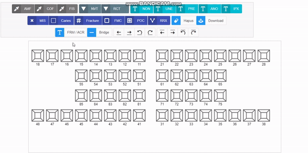
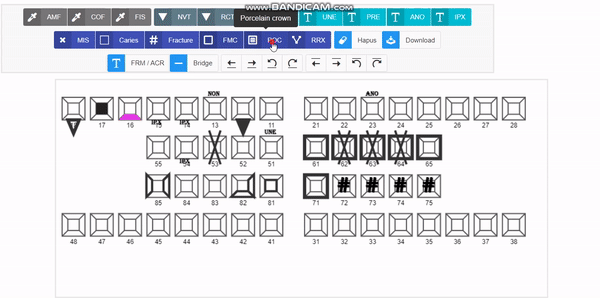
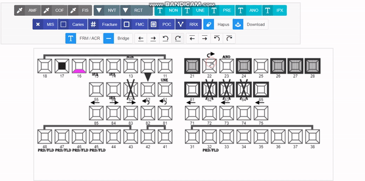

# jquery-odontogram plugin

Easy to use jQuery plugin for creating Odontogram using HTML5 Canvas.

Example
-----




Usage
-----
Initialize Odontogram, make sure the element is a Canvas.
```bash
$("#odontogram-canvas").odontogram({
	width: "900px",
	height: "420px"
});
```

Set to Default mode.
```bash
$("#odontogram-canvas").odontogram('setMode', ODONTOGRAM_MODE_DEFAULT);
```

Set to Delete mode.
```bash
$("#odontogram-canvas").odontogram('setMode', ODONTOGRAM_MODE_HAPUS);
```

Set to AMF mode.
```bash
$("#odontogram-canvas").odontogram('setMode', ODONTOGRAM_MODE_AMF);
```

Set to AMF mode.
```bash
$("#odontogram-canvas").odontogram('setMode', ODONTOGRAM_MODE_AMF);
```

Set to COF mode.
```bash
$("#odontogram-canvas").odontogram('setMode', ODONTOGRAM_MODE_COF);
```

Set to FIS mode.
```bash
$("#odontogram-canvas").odontogram('setMode', ODONTOGRAM_MODE_FIS);
```

Set to NVT mode.
```bash
$("#odontogram-canvas").odontogram('setMode', ODONTOGRAM_MODE_NVT);
```

Set to RCT mode.
```bash
$("#odontogram-canvas").odontogram('setMode', ODONTOGRAM_MODE_RCT);
```

Set to NON mode.
```bash
$("#odontogram-canvas").odontogram('setMode', ODONTOGRAM_MODE_NON);
```

Set to UNE mode.
```bash
$("#odontogram-canvas").odontogram('setMode', ODONTOGRAM_MODE_UNE);
```

Set to PRE mode.
```bash
$("#odontogram-canvas").odontogram('setMode', ODONTOGRAM_MODE_PRE);
```

Set to ANO mode.
```bash
$("#odontogram-canvas").odontogram('setMode', ODONTOGRAM_MODE_ANO);
```

Set to CARIES mode.
```bash
$("#odontogram-canvas").odontogram('setMode', ODONTOGRAM_MODE_CARIES);
```

Set to CFR mode.
```bash
$("#odontogram-canvas").odontogram('setMode', ODONTOGRAM_MODE_CFR);
```

Set to FMC mode.
```bash
$("#odontogram-canvas").odontogram('setMode', ODONTOGRAM_MODE_FMC);
```

Set to POC mode.
```bash
$("#odontogram-canvas").odontogram('setMode', ODONTOGRAM_MODE_POC);
```

Set to RRX mode.
```bash
$("#odontogram-canvas").odontogram('setMode', ODONTOGRAM_MODE_RRX);
```

Set to MIS mode.
```bash
$("#odontogram-canvas").odontogram('setMode', ODONTOGRAM_MODE_MIS);
```

Set to IPX mode.
```bash
$("#odontogram-canvas").odontogram('setMode', ODONTOGRAM_MODE_IPX);
```

Set to FRM_ACR mode.
```bash
$("#odontogram-canvas").odontogram('setMode', ODONTOGRAM_MODE_FRM_ACR);
```

Set to BRIDGE mode.
```bash
$("#odontogram-canvas").odontogram('setMode', ODONTOGRAM_MODE_BRIDGE);
```

Set to ARROW_TOP_LEFT mode.
```bash
$("#odontogram-canvas").odontogram('setMode', ODONTOGRAM_MODE_ARROW_TOP_LEFT);
```

Set to ARROW_TOP_RIGHT mode.
```bash
$("#odontogram-canvas").odontogram('setMode', ODONTOGRAM_MODE_ARROW_TOP_RIGHT);
```

Set to ARROW_TOP_TURN_LEFT mode.
```bash
$("#odontogram-canvas").odontogram('setMode', ODONTOGRAM_MODE_ARROW_TOP_TURN_LEFT);
```

Set to ARROW_TOP_TURN_RIGHT mode.
```bash
$("#odontogram-canvas").odontogram('setMode', ODONTOGRAM_MODE_ARROW_TOP_TURN_RIGHT);
```

Set to ARROW_BOTTOM_LEFT mode.
```bash
$("#odontogram-canvas").odontogram('setMode', ODONTOGRAM_MODE_ARROW_BOTTOM_LEFT);
```

Set to ARROW_BOTTOM_RIGHT mode.
```bash
$("#odontogram-canvas").odontogram('setMode', ODONTOGRAM_MODE_ARROW_BOTTOM_RIGHT);
```

Set to ARROW_BOTTOM_TURN_LEFT mode.
```bash
$("#odontogram-canvas").odontogram('setMode', ODONTOGRAM_MODE_ARROW_BOTTOM_TURN_LEFT);
```

Set to ARROW_BOTTOM_TURN_RIGHT mode.
```bash
$("#odontogram-canvas").odontogram('setMode', ODONTOGRAM_MODE_ARROW_BOTTOM_TURN_RIGHT);
```


Contribute
----
If you like the project please support with your contribution.

[Donate on Paypal](https://www.paypal.me/adhiana46)

Thank you and Happy Coding :)